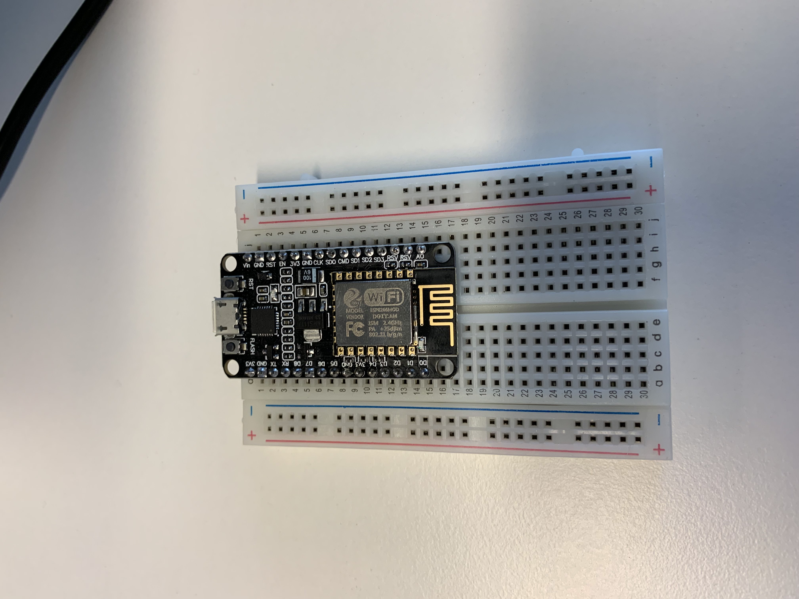

# Pink flamingo's automated plant health system

## Introduction

This school project is a projcet to monitor the health of a plant.
The plant will check the humidity of the soil, the amount of light, the humidity of the air and the temperature. There is also a motion sensor. This can be used when someone tries to steal your plant.
We have a solanoid valve that can water your plant automatically.

### parts in this wiki

* Requirements
* Programming the ESP module
* Starting with the IBM cloud
* Using NodeRed

### Requirements

* 1 ESP-8266 (NodeMcu)
* 1 DHT11 or a DHT22 if you want to have more accurate results
* A PID sensor (Motion sensor)
* Soil moisture sensor (Flying fish)
* Light sensor (Flying fish)
* Electric solenoid valve 12V DC Normally closed
* Songle SRD-05VDC-SL-C (Relay)
* Some breadboards (we used 3)
* Tubing for watering the plant (In case you have the solenoid valve, you need to use threaded 1/4inch tubing)
* An LED
* Jumper wires (Male-Male (Homosexual) & Male-Female (Heterosexual) & Female-Female (Lesbian))
* Micro-USB cable
* 12V DC power outlet

### First steps

1. set the ESP module on a breadboard

    

2. Setup the sensors on the breadboard and set the voltage pins correctly

3. Connect the sensors to the ESP module

    
    
    
    
    

4. Now we can start programming the ESP module and use the IBM cloud

### Programming the ESP module

* First, we need to connect to the wifi

```C++

```

### Starting with the IBM cloud

### Using NodeRed